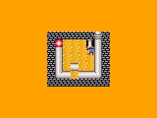

# PipesCE (C)
Pipes game for the TI-84PCE written in C using the [CE C Toolchain](https://ce-programming.github.io/toolchain/).
 

Based off of the PICO-8 version called ["Toy Box Pipe"](https://www.lexaloffle.com/bbs/?tid=36432)  

### Features

- World map
- Saving & loading
- Automatic save data upgrading (reformats save data if it changes between updates)
- Animated tiles
- RLE Compressed levels
- A cool custom array library

#### Controls
 - *Arrow keys* to move
 - *2nd* to pull a pipe
 - *Clear* to go back or exit
 - *2nd*/*Enter* to go forwards

### Future Plans
- Level editor
- All levels
- Randomized level Generation??
